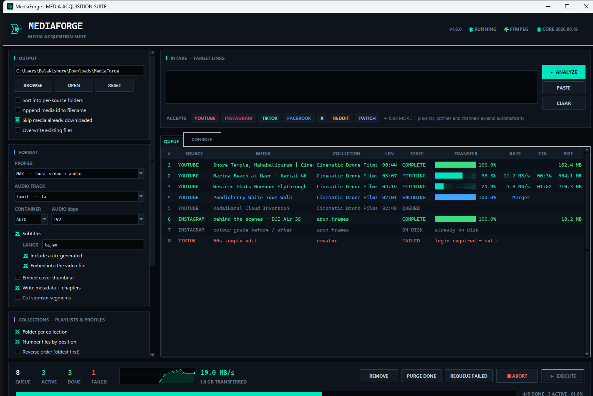

# MediaForge

**Media acquisition suite** — a desktop app for pulling video and audio off the web.
Paste links, press **EXECUTE**.



- **Playlists, profiles and channels download in full.** Paste a YouTube playlist,
  a channel, or an Instagram profile and MediaForge expands it into its individual
  media, files them in a folder named after the collection, and numbers them in order.
- **Instagram, YouTube, TikTok, Facebook, X, Reddit, Twitch** and 1800+ other sites.
- **Picks the audio language.** Videos with dubbed tracks download in the language
  you choose, with subtitles in any languages you list.
- Parallel transfers, live per-item progress, throughput graph, resumable downloads.

## Running it

```powershell
cd MediaForge
python app.py
```

or double-click **`run.bat`** (starts with no console window).

Requirements: Python 3.9+ (tkinter ships with the standard Windows installer),
the extraction engine, and — strongly recommended — **ffmpeg** on your `PATH`:

```powershell
python -m pip install -r requirements.txt
winget install Gyan.FFmpeg
```

Without ffmpeg the app still runs, but it can only take single pre-merged streams
(usually capped at 720p) and cannot convert to MP3 or embed thumbnails and
subtitles. The header shows an amber `NO FFMPEG` light when it is missing.

## Building a standalone `.exe`

```powershell
.\build_exe.ps1                  # -> dist\MediaForge.exe
.\build_exe.ps1 -IncludeFFmpeg   # bundle the ffmpeg on PATH into the exe
.\build_exe.ps1 -OneDir          # folder build, faster startup
```

The result needs no Python installation.

## Instagram

Every Instagram URL form is supported:

| Link | Result |
| --- | --- |
| `instagram.com/p/<id>/` | single post |
| `instagram.com/reel/<id>/` | single reel |
| `instagram.com/tv/<id>/` | IGTV video |
| `instagram.com/stories/<user>/` | that user's stories |
| `instagram.com/<user>/` | **the profile's whole feed**, expanded like a playlist |

Instagram serves almost nothing to logged-out clients, so set
**NETWORK · AUTH ▸ SESSION COOKIES** to the browser you are logged into.
Close that browser first — Chromium-based browsers lock their cookie database
while running. MediaForge warns in the console when you queue a link from a
platform that usually needs a login and no cookie source is set.

## Languages

Many channels now ship one video with a dozen dubbed audio tracks. A MrBeast
upload, for instance, carries **22 audio tracks**, 25 hand-written subtitle
languages and 157 auto-generated ones.

**FORMAT ▸ AUDIO TRACK** picks which dub to download — `AUTO` takes whatever the
site marks as the original. If a video does not offer the language you asked for,
MediaForge falls back to the original track rather than failing, and the console
reports the track that was actually taken:

```
✓ Escape 100 Cops, Win $500,000  [audio: ta]
```

**FORMAT ▸ Subtitles ▸ LANGS** takes a comma-separated list — `en`, `en,ta,hi`,
or `all` for every language a video offers. *Include auto-generated* adds machine
captions (avoid pairing it with `all` — that is 150+ files per video), and
*Embed into the video file* muxes them in instead of leaving `.srt` files beside
the video.

To see what a specific video actually has, queue it, then **right-click the row ▸
Inspect tracks**. The console lists every audio track and subtitle language:

```
tracks · Escape 100 Cops, Win $500,000
   22 audio track(s):
      en        English original (default)   <- original
      hi        Hindi
      ta        Tamil
      ...
   25 subtitle language(s): ar, bn, de, en, es, fil, fr, hi, id, it, ...
   157 auto-generated caption language(s)
```

Audio-only profiles honour the same setting, so `AUDIO · MP3` with **AUDIO TRACK**
set to Tamil gives you a Tamil-dubbed MP3.

## The interface

**INTAKE** — one URL per line, any mix of platforms. `Ctrl+Enter` is the same as
pressing **ANALYZE**. Analysis resolves each link and expands collections; adding
a link that expands past 150 items asks for confirmation first, so a channel with
thousands of uploads cannot flood the queue by accident.

**QUEUE** — one row per media file with source, collection position, state,
transfer bar, rate, ETA and size. Failed rows show the reason inline.

- **Double-click** — open the finished file, or the source page if not fetched yet
- **Right-click** — open file, show in folder, **inspect tracks**, copy link, requeue, remove
- **Delete** — remove selected rows

**CONSOLE** — timestamped engine log, colour-coded by severity.

**Telemetry bar** — queue/active/done/failed counters, a rolling throughput graph,
aggregate rate, session volume, and overall progress.

### Sidebar

| Panel | What it controls |
| --- | --- |
| **OUTPUT** | Destination folder; per-source subfolders (`YOUTUBE\`, `INSTAGRAM\`); append media id to filenames; skip media already downloaded; overwrite. |
| **FORMAT** | Quality profile from `MAX` down to `480p`, `MIN`, or audio-only MP3/M4A; **audio track language**; output container; audio bitrate; **subtitles and their languages**; cover thumbnail, metadata + chapters, sponsor-segment removal. |
| **COLLECTIONS** | Folder per collection; number files by playlist position; reverse order; treat a link as a single video; **RANGE** to take part of a collection (`1-25`, `3,7,12-`, `-10`). |
| **NETWORK · AUTH** | Parallel threads (1–8); per-download rate cap (`2M`, `500K`); session cookies from a browser; proxy. |

**Skip media already downloaded** keeps a `.mediaforge-archive.txt` in the output
folder. Re-run a playlist later and only the new items are fetched.

Settings are saved to `%LOCALAPPDATA%\MediaForge\settings.json` when a batch starts
and when the app closes.

## Layout

| File | Purpose |
| --- | --- |
| `app.py` | UI, queue management, threading |
| `core.py` | engine wrapper: collection expansion, option building, downloading |
| `theme.py` | dark palette, ttk styling, custom widgets |
| `build_exe.ps1` | PyInstaller packaging |
| `make_icon.py` | regenerates `icon.ico` from the brand mark |
| `run.bat` | console-free launcher |

`core.py` has no UI dependencies, so it can be scripted directly:

```python
import threading
import core

settings = {'outdir': r'D:\Media', 'quality': '1080p  ·  Full HD',
            'playlist_folder': True, 'number_playlist_items': True}
items, label = core.expand_url('https://www.youtube.com/playlist?list=...', settings)
print(f'{label}: {len(items)} media')
for item in items:
    core.download_item(item, settings, lambda i: None, print, threading.Event())
```

## Engine

Extraction is handled by [yt-dlp](https://github.com/yt-dlp/yt-dlp) (Unlicense).
MediaForge finds it as an installed package, or falls back to a source checkout —
set `MEDIAFORGE_ENGINE_PATH` to point at one. The header shows the engine version.

Download only what you have the right to download, and respect each site's terms.
